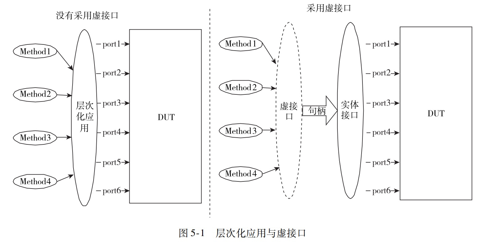

基本概念

------

把虚接口看成对应接口类型的一个句柄 （ handle）

总结采用虚接口的七个步骤如下。
１） 定义接口 （ Ｓｂｕｓ） ， 该接口可供所有具有相同端口的模块或者类使用。
２） 在事务交易处理器的类中 （ Ｓｂｕｓ＿ｔｒａｎｓａｃｔｏｒ） 添加一个对应接口类型的 （ Ｓｂｕｓ） 虚接口成员 （ ｂｕｓ） 。
３） 在事务交易处理器类的构造函数中， 添加一个对应接口类型的虚接口的参数 （ｓ） 。
４） 在事务交易处理器的构造函数体内将参数 （ ｓ） 赋值给虚接口成员 （ Ｓｂｕｓ） 

。注意： 到此， 我们就可以在事务交易处理器中， 编写针对该接口的通用方法 （ 如 ｒｅｑｕｅｓｔ和 ｗａｉｔ＿ｆｏｒ＿ｂｕｓ） ， 只要针对虚接口进行操作即可， 而该虚接口不针对特定的具体器件， 只有在事务交易处理器的对象例化创建的时候， 根据具体传给它的参数确定。
５） 在被测设计同一个层次例化实体接口（ ｓ［ １：４］ （ ） ） 。
６） 将被测设计 （ ａ１ ／ｂ１ ／ａ２ ／ｂ２） 的例化端口和实体接口相连接 （ Ａ ／Ｂ 两种方式） 。
７） 例化并创建事务处理器对象， 并将实体接口作为参数传递给其例化。