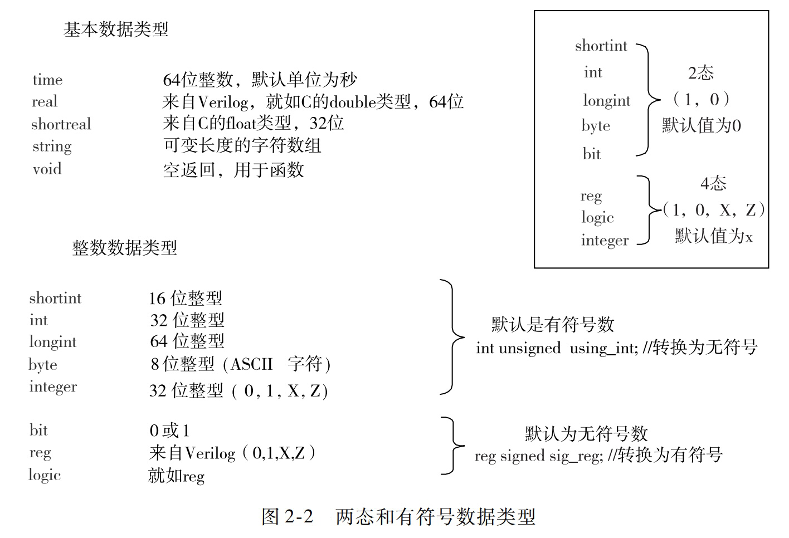
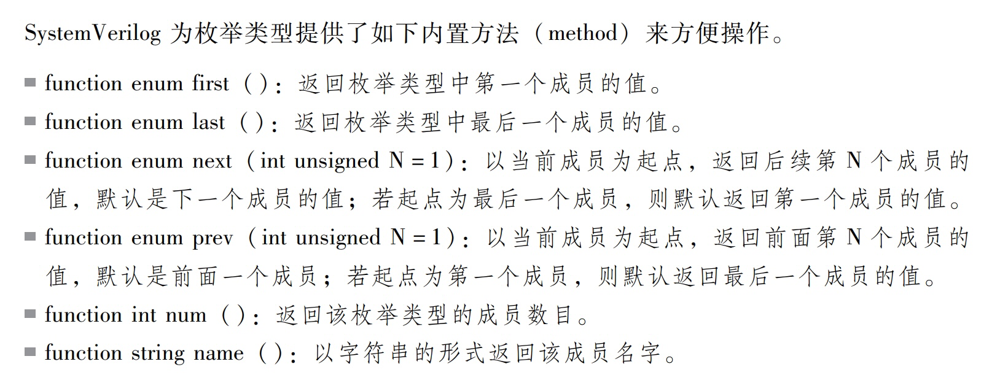
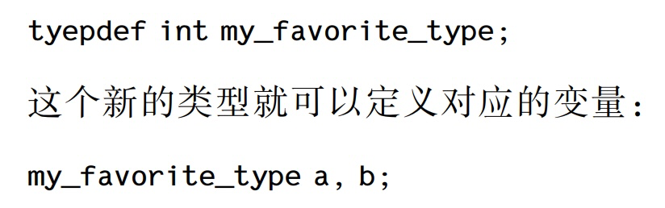
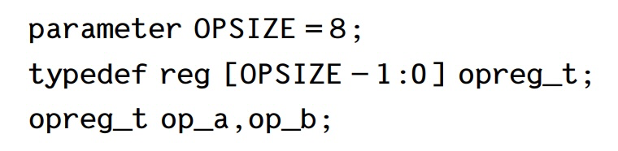
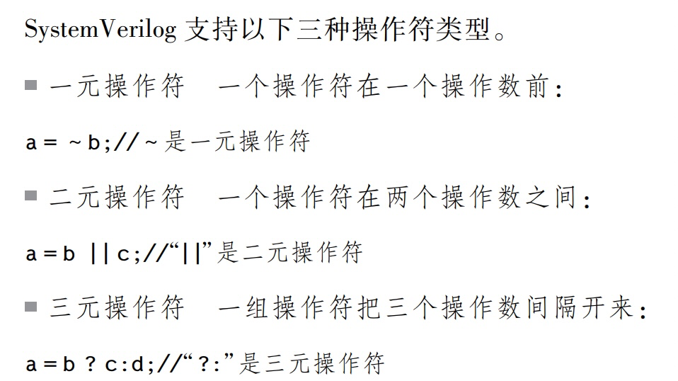
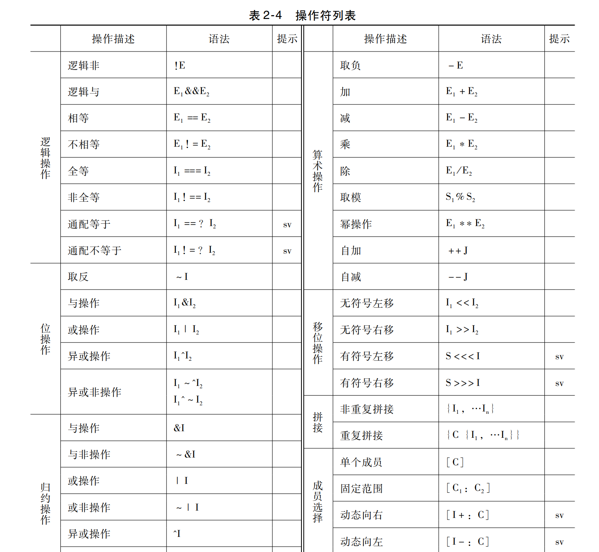
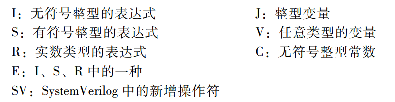

###### 

####  数据类型

------

###### 目录

[TOC]

------

##### 两态

Sv 引入了两态的数据类型来减少仿真器对内存的使用和提高仿真的运行效率， 其中 bit 是无符号数， 其他四个是有符号数：short int/int/longint/byte

sv 对 reg的数据类型作了改进， 可以被连续赋值语句、 门逻辑和模块直接驱
动。 另外，sv 还引入了一个新的四态数据类型 logic， 可以代替 reg； 但是不能用在双向总线和多驱动的情况下， 此时只能使用网线类型， 例如 wire.

------

##### 枚举

枚举类型可以用来声明一组整型的命名常量， 定义具有强类型的枚举变量。 枚举类型还可以使用枚举名字而不是枚举值来方便地引用或显示

###### 格式

`enum [data_type] {name1 = value1, name2 = value2···，nameN = valueN} var name;`

当没有指定数据类型的时候， 缺省的数据类型是 int。 在枚举类型中使用的任何其他数据类型都要求显式地声明。

无论是枚举名 还是它们的 （ 整型） 数值都必须是唯一的。 它们的值可以被设置为任意整型常量值， 或者从初始值 ０ 开始递增 （ 默认情况） 。 如果将两个值设置到相同的枚举名， 或者设置的值与递增值冲突都是非法的定义。

枚举类型是一种强类型， 枚举变量在赋值、 传递和关系操作符中进行类型检查， 因此**<u>枚举变量不能被在枚举集合范围以外的数值直接赋值</u>**， 除非使用强制类型转换或者该枚举变量是一个联合体的成员。 枚举变量可以自动转换成整型值， 在表达式中作为常量使用， 并且运算结果也可以赋值到任何一个兼容的整型变量。

###### sv提供的函数操作

------

##### 用户自定义类型typedef

通过使用 typedef 关键字进行用户自定义类型的扩展。 定义新的数据类型可以提高代码的可读性， 复杂的数据类型 （ 结构体、 联合体等） 和特定的数组可以通过使用一个简单易懂的名字 （ 别名） 被定义为一个新的数据类型.

其实你并未创建一个新的数据类型， 而只是在做文本替换；将一个特定的数组定义为新的数据类型， 例如：

有时， 一个 用 户 自 定 义 类 型 需 要 在 类 型 的 内 容 被 定 义 之 前 声 明。 这 对 于 由 enum、
struct、 union 和 class 派生出的用户定义类型很有用处

------

##### 数组/队列

- ###### 静态数组 static array/fixed - size array

静态数组是指其数组的大小在定义时被显性地指定。

压缩数组：维数的定义在变量标识符之前

非压缩数组：非压缩数组指的是维数的定义在变量标识符之后

- ###### 动态数组 dynamic array

- ###### 关联数组 associative array

- ###### 队列 queue

##### 字符串

##### 结构体和联合体

常量

#### 文本表示

##### 数值表示

##### 字符串表示

##### 结构体表示

##### 数组表示

##### 时间表示

##### 注释方式

#### 操作符/表达式

#### 过程语句

##### 赋值语句

##### 条件选择语句

##### 循环语句

##### 跳转语句

##### 子程序调用

##### 事件控制

#### 函数/任务
