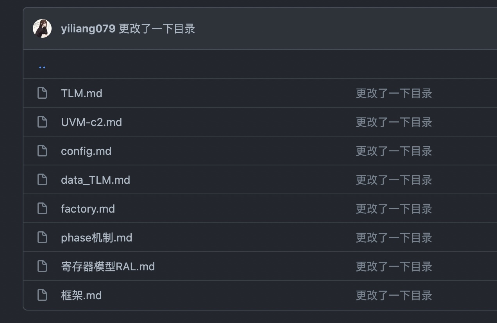
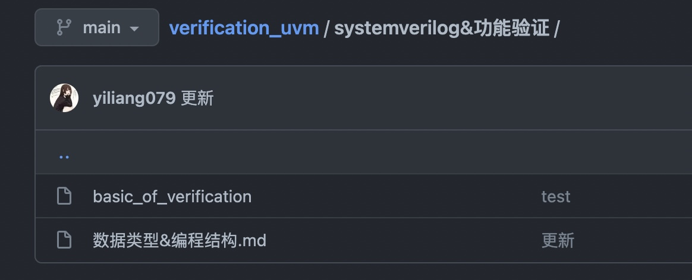

### **beihai实习工作总结**

[TOC]

#### 学习阶段

------

主要是对验证方面的知识进行系统地学习。相关的学习笔记存在个人github中

[yiliang079/verification_uvm: useless (github.com)](https://github.com/yiliang079/verification_uvm)

##### 1、学习UVM框架/组件知识

约15天

主要是结合《UVM实战》、《systemverilog验证》、《芯片漫游指南》3本国内比较系统讲解验证思想和代码的书，并结合e课网的数字ic验证班网课学习相关的课。对uvm中的各类组件，如`driver`、`monitor`、`agent`、`sequence`、`item`等的作用有了充分的深入了解。

##### 2、做`synopsys uvm lab`实验。

约15天

官网提供的实验指南，lab1-lab3用了一周多，后面lab4-lab6用了1周多，主要是熟悉框架，并且还需要自己码代码，实验中也输入了很多验证方法学的思想。寄存器模型的lab6较难，还需要花更多时间来理解。

##### 3、学习浮点数据相关知识

3天

[verification_uvm/浮点数据数值计算.md at main · yiliang079/verification_uvm (github.com)](https://github.com/yiliang079/verification_uvm/blob/main/浮点数据数值计算.md)

学习fp16，fp32，bf16等浮点数据类型的结构，还有熟悉浮点数据的加减法、乘除法，舍入规则。

##### 4、sv的系统学习

大约5天

主要是对覆盖率、断言还有`interface`方面的systemverilog知识学习

##### 5、AMBA总线协议学习

学习中

##### 6、npu架构和相关功能的学习

学习中

上周秦旋给我们实习生讲了讲npu的文档，目前对npu的架构又了比较深入的认识，对其中卷积的硬件实现方法和加速方法有了深刻地理解。目前在看技术文档

#### 项目阶段

------

本阶段从新年回来第二天开始，首先是对fp16的乘法进行验证，然后验证设计实习写的bfp20和24的乘法，然后继续完成加法的验证。

##### 7、uvm验证环境的搭建

1周

由于是第一次搭建uvm环境，第一次造轮子，每一个组件基本都是自己写的，搭建和调试花了1周，并成功运行。

##### 8、fp16乘法的`refer model`搭建

1周

花了大约一周来写参考模型，本模型适用于所有浮点类型数据的输入，如0、规格数据、非规格数据、无穷大和nan类型的数据输入，并符合IEEE 754标准。并且完成了fp16乘法的`teat case`开发，收集代码覆盖率和功能覆盖率，并且跑了回归。在回归中发现一个比较重要的bug。并提交给元祥完成了修改。

**在两个数相乘的得到的结果比较小的情况下，尾数最后一位的舍入不正确，造成了精度的误差，并且这种情况较为常见。**

如上图所示，乘法器最后一位有错误，已提交并修改完成。由于bfp20/24由fp16改，因此也有同样的错误，已修改完毕。

##### 9、bfp20/24的验证

2天

直接用fp16的环境更改相关位宽即可，其中发现不少bug，已和设计实习同事沟通并也已经完成修改。

##### 10、fp16加法的`refer model`搭建

4天

由于已有验证环境，因此只需重写`refer model`即可。加法的文档不是很全，因此很多东西需要自己补全，过程碰壁不少，但是有乘法器参考模型的经验，因此还是较快地完成了模型搭建。

**编写功能点，并跑回归发现还是有之前fp16乘法器的错误，在得数很小时，结果的最后一位存在舍入错误，已提交宝庆修改，还在修改中，等待修改完成继续验证。**

##### 11、bfp20/bfp24加法的验证

1天

直接对fp16加法环境相关数据修改即可，bfp20/bfp24都存在一点问题，尾数和指数位都有较多错误存在，已反馈给设计实习同事，等待修改完毕继续完成后续验证。

#### 感想

短短两个月的实习即将过去了，在这两个月里，我较为系统地学习了验证方法学中比较常用的验证方法，uvm和sv。也比较深入地学习了uvm中相关组件的功能，其中包含的思想等等。同时也在这个过程中完成了一个小项目，完成了fp16/bfp20/bfp24和加法器和乘法器的验证，并且发现了不少bug，这个过程中也得到了不少同事的帮助。最重要的是在这个项目中完成了一次验证的流程，从阅读技术文档，到搭建环境、编写参考模型、编写test case、收集功能覆盖率和代码覆盖率、也跑了回归。这些过程都是验证中缺一不可的，能在实习中完整走了一遍，受益匪浅。

以上是相关模块的验证环境。