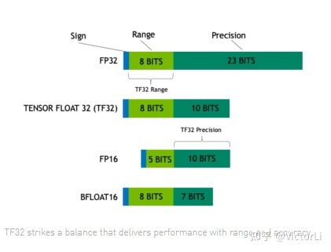
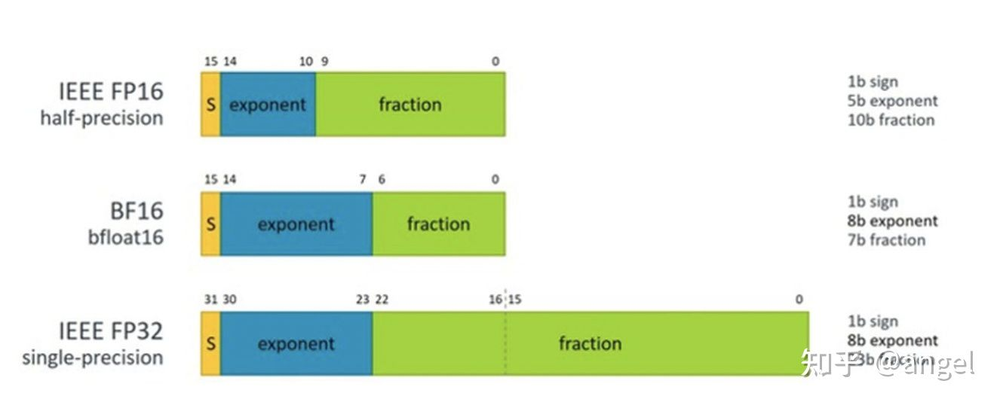
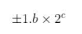
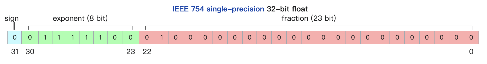
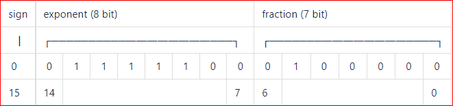

### 浮点数据数值计算

[IEEE-754 Floating Point Converter (h-schmidt.net)](https://www.h-schmidt.net/FloatConverter/IEEE754.html)

IEEE 754 标准是IEEE二进位浮点数算术标准(IEEE Standard for Floating-Point Arithmetic)的标准编号。IEEE 754 标准规定了计算机程序设计环境中的二进制和十进制的浮点数自述的交换、算术格式以及方法。

------

#### 概述

浮点数据类型主要分为双精度（Fp64）、单精度（Fp32）、半精度（FP16）。在神经网络模型的训练过程中，一般默认采用单精度（FP32）浮点数据类型，来表示网络模型权重和其他参数。

**常见的浮点类型有fp16，fp32，bf16，tf32，fp24，pxr24，ef32，能表达的数据范围主要看exponent，精度主要看fraction。**




可以看出表达的数据范围看fp32，bf16，tf32，pxr24和ef32都是一样的，因为大家能表达的都是-2^254 ~ 2^255 这个大概范围。fp24到表达范围比上面这些小，是 -2^126 ~ 2^127 

从精度上看fp32 > pxr24 > ef32 > tf32 > bf16，燧原的ef32都精度比Nvidia的fp32的精度多了一位，但都显著优于google的bf16，燧原的ef32，Nvidia的tf32都是使用fp16的计算性能像fp32的表达范围靠齐的一种尝试。




------

##### 浮点数据表示


FP16可以表示的最大值为 0 11110 1111111111，计算方法为：

![[公式]](https://www.zhihu.com/equation?tex=%28-1%29%5E0%5Ctimes2%5E%7B30-15%7D%5Ctimes1.1111111111+%3D+1.1111111111%28b%29%5Ctimes2%5E15+%3D+1.9990234375%28d%29%5Ctimes2%5E15+%3D+65504+)

FP16可以表示的最小值为 0 00001 0000000000，计算方法为：

![[公式]](https://www.zhihu.com/equation?tex=+%28-1%29%5E%7B-1%7D%5Ctimes2%5E%7B1-15%7D%3D2%5E%7B-14%7D%3D6.104%C3%9710%5E%7B-5%7D%3D-65504)

因此FP16的最大取值范围是[-65504 - 66504]，能表示的精度范围是 ![[公式]](https://www.zhihu.com/equation?tex=2%5E%7B-24%7D) ，超过这个数值的数字会被直接置0。


**根据IEEE 754标准，任意一个二进制浮点数都可以表示成以下形式：**


**S为数符，它表示浮点数的正负（0正1负）；M为有效位（尾数）；E为阶码，用移码表示，阶码的真值都被加上一个常数（偏移量）。**

**尾数部分M**通常都是规格化表示的，即非"0"的尾数其第一位总是"1"，而这一位也称**隐藏位**，因为存储时候这一位是会被**省略**的。比如保存1.0011时，只保存0011，等读取的时候才把第一位的1加上去，这样做相当于**多保存了1位有效数字**。

故float存储的数字可以写成:





1. Sign（1位）：用来表示浮点数是正数还是负数，0表示正数，1表示负数

2. Exponent（8位）：指数部分。即上文提到数字c，但是这里不是直接存储c，为了同时表示正负指数以及他们的大小顺序，这里实际存储的是c+127

3. Mantissa（23位）：尾数部分。也就是上文中提到的数字b。

    [IEEE-754 Floating Point Converter (h-schmidt.net)](https://www.h-schmidt.net/FloatConverter/IEEE754.html)

    <u>（数值验证用）</u>

    

------

##### fp64双精度

双精度下，指数保留11位，有效位数为52位，从而极大地扩展了它可以表示的数字范围和大小。半精度则是表示范围更小，其指数只有5位，有效位数只有10位。


------

##### fp32单精度


在单精度32位格式中，1位用于指示数字为正数还是负数。指数保留了8位，这是因为它为二进制，将2进到高位。其余23位用于表示组成该数字的数字，称为有效数字。


------

##### fp16半精度


半精度的格式与单精度的格式类似，最左边的一位仍是符号位，指数有5位宽且以余-16（excess-16)的形式存储，尾数有10位宽，但具有隐含1。

与32位相比，采用BF16/FP16吞吐量可以翻倍，内存需求可以减半。但是这两者精度上差异不一样，BF16 可表示的整数范围更广泛，但是尾数精度较小；FP16 表示整数范围较小，但是尾数精度较高。

------

##### BF16

[(18条消息) 深度学习与bfloat16（BF16）_鱼落池中-CSDN博客_bfloat16](https://blog.csdn.net/Night_MFC/article/details/107869478?utm_medium=distribute.pc_relevant.none-task-blog-2~default~baidujs_baidulandingword~default-0.pc_relevant_default&spm=1001.2101.3001.4242.1&utm_relevant_index=3)



<u>BF16数字表示为：</u>

<u>1个符号位＋ 8个指数位＋7个尾数位（总共16位）。</u>

<u>这些16位数字提供了谷歌所追求的高吞吐量需求，同时保留了FP32的近似动态范围（该系统可以表示的数字的整个范围），因为指数是相同的大小。</u>

‘BF16’，专为人工智能(AI)/深度学习(DL)应用优化发展而来，有时也称‘BFloat16’或‘Brain Float 16’。它一开始是由Google Brain团队发明，并用于其第三代Tensor Processing Unit (TPU)，如今已被Google、英特尔(Intel)、Arm等许多公司的AI加速器广泛采用。

深度学习中一般不需要FP64，FP32这种高精度的浮点格式。虽然这两种浮点格式数据精度高，但也增加了存储成本和处理过程中的时间成本。如果有一种数据格式能解决FP64，FP32这两种数据格式的这两个缺点，同时又能满足一定的精度要求，那无疑会大大提高深度学习模型的推理速度和部署灵活性。

这种数据格式就是BF16，使用BF16算法的预测精度与FP32相似，但不如FP32精确（谷歌曾说过，这是因为神经网络对指数的大小比尾数敏感得多）。对于大多数应用程序，尤其是计算机视觉和语音方面，这种折衷是可以接受的。

采用16位脑浮点(brain floating point)格式的BF16，主要概念在于透过降低数字的精度，从而减少让张量(tensor)相乘所需的运算资源和功耗。「张量」是数字的三维(3D)矩阵；张量的乘法运算即是AI计算所需的关键数学运算。

如今，大多数的AI训练都使用FP32，即32位浮点数。尽管这表示可以达到非常准确的计算，但需要强大的硬件而且极其耗电。推论一般使用INT8，即8位整数精度的运算模式，虽然是较低精度的数字系统，但在相同硬件上提供了更高的传输效率，因而能够更省电，只是计算结果(预测)的准确性较低些。

**BF16的基本概念是为精度和预测准确性之间的权衡进行优化，从而提高吞吐量。**

使用BF16算法的预测精度与FP32相似，但不如FP32精确（谷歌曾说过，这是因为[神经网络](http://www.elecfans.com/tags/神经网络/)对指数的大小比尾数敏感得多）。对于大多数应用程序，这种折衷还是被认为可以接受。

------


#### 数值计算

[如何避开JavaScript浮点数计算精度问题（如0.1+0.2!==0.3） - 知乎 (zhihu.com)](https://zhuanlan.zhihu.com/p/33333351)

##### before：如何将小数转成二进制？

**① 整数部分：**除2取余数，若商不为0则继续对它除2，当商为0时则将所有余数逆序排列；

**② 小数部分：**乘2取整数部分，若小数不为0则继续乘2，直至小数部分为0将取出的整数位正序排列。（若小数部分无法为零，根据有效位数要求取得相应数值，位数后一位0舍1入进行取舍）

**利用上述方法，我们尝试一下将0.1转成二进制：**

```
0.1 * 2 = 0.2 - - - - - - - - - - 取0
0.2 * 2 = 0.4 - - - - - - - - - - 取0
0.4 * 2 = 0.8 - - - - - - - - - - 取0
0.8 * 2 = 1.6 - - - - - - - - - - 取1
0.6 * 2 = 1.2 - - - - - - - - - - 取1
0.2 * 2 = 0.4 - - - - - - - - - - 取0
......
```

算到这就会发现小数部分再怎么继续乘都**不会等于0**，所以**二进制是没办法精确表示0.1的**。

那么0.1的二进制表示是：0.000110011......0011...... (0011无限循环)

而0.2的二进制表示则是：0.00110011......0011...... (0011无限循环)

而具体应该保存多少位数，则需**要根据使用的是什么标准来确定**

[(18条消息) 浮点加法、减法, 乘法、除法运算_嵌入式技术在路上-CSDN博客_浮点数除法](https://blog.csdn.net/xingqingly/article/details/18981671?ops_request_misc=%7B%22request%5Fid%22%3A%22164433271416780269811687%22%2C%22scm%22%3A%2220140713.130102334..%22%7D&request_id=164433271416780269811687&biz_id=0&utm_medium=distribute.pc_search_result.none-task-blog-2~all~sobaiduend~default-2-18981671.first_rank_v2_pc_rank_v29&utm_term=浮点运算&spm=1018.2226.3001.4187)


##### 1、加减法

例子：

0.1 => `0,01111111011;1001100110011001100110011001100110011001100110011010`

0.2 => `0,01111111100;1001100110011001100110011001100110011001100110011010`

**浮点数的加减运算按以下几步进行：**

###### **① 对阶**

使两数的小数点位置对齐（也就是使两数的阶码相等）。

所以要先求阶差，阶小的尾数要根据阶差来右移**（尾数位移时可能会发生数丢失的情况，影响精度）**

因为0.1和0.2的阶码和尾数均为正数，所以它们的原码、反码及补码都是一样的。（使用补码进行运算，计算过程中使用双符号）

**△阶差(补码)** = `00,01111111011 - 00,01111111100 = 00,01111111011 + 11,10000000100 = 11,11111111111`

由上可知**△阶差为-1**，也就是0.1的阶码比0.2的小，所以要把0.1的**尾数右移1位，阶码加1**（使0.1的阶码和0.2的一致）

最后0.1 => `0,01111111100;1100110011001100110011001100110011001100110011001101**(0)**`

*注：要注意0舍1入的原则。之所以右移一位，尾数补的是1，是因为隐藏位的数值为1（默认是不存储的，只有读取的时候才加上）*


###### **② 尾数求和**

`0.1100110011001100110011001100110011001100110011001101`

`+ 1.1001100110011001100110011001100110011001100110011010`

————————————————————————————————————

`10.0110011001100110011001100110011001100110011001100111`


###### **③ 规格化**

规格化处理主要是针对浮点数的尾数部分，规格化的尾数格式要求如下:
尾数采用原码表示形式时：正数的规格化格式为：0.1XXX，负数的规格化形式为1.1XXX。
尾数采用补码表示形式时，正数的规格化格式为：0.1XXX，负数的规格化形式为：1.0XXX。
以上的最高位均代表符号位(0代表正数，1代表负数)，关键是看小数点后面的数的格式。

**凡不符合以上格式要求的尾数均要进行规格化，对以上规格化格式进行总结可以得出：**

符号位与尾数最高位不一致才算是规格化，一致为非规格化。如1.0XXX，0.1XXX(最前面的为符号位)之类的尾数都是规格化的数，而1.1XXX，0.0XXX为非规格化的数，另外，如果尾数大余1，也是非规格化数。
对于非规格化的尾数需要进行相应的处理，处理方式又分为"左规"和"右规"，所谓"左规"就是尾数需要向左移位，每移1位阶码值减1，直到为规格化数为止，对应"右规"就是尾数要向右移位，每移1位阶码值减1，直到为规格化数为止。

**进位溢出：右规；负数：左规**

针对步骤②的结果，需要**右规**（即尾数右移1位，阶码加1）

sum = 0.1 + 0.2 = `0,01111111101;1.0011001100110011001100110011001100110011001100110011**(1)**`

*注：右规操作，可能会导致低位丢失，引起误差，造成精度问题。所以就需要步骤④的舍入操作*


###### **④ 舍入（0舍1入）**

sum = `0,01111111101;1.0011001100110011001100110011001100110011001100110100`


###### **⑤ 溢出判断**

根据阶码判断浮点运算是否溢出。此处阶码01111111101即不上溢，也不下溢。


------

##### 2、乘除法

[(18条消息) 浮点数的乘除法运算_zs_Dec04的博客-CSDN博客_浮点数乘法](https://blog.csdn.net/qq_47114658/article/details/111599175?ops_request_misc=%7B%22request%5Fid%22%3A%22164437243416780274150628%22%2C%22scm%22%3A%2220140713.130102334..%22%7D&request_id=164437243416780274150628&biz_id=0&utm_medium=distribute.pc_search_result.none-task-blog-2~all~top_click~default-1-111599175.first_rank_v2_pc_rank_v29&utm_term=浮点数乘法&spm=1018.2226.3001.4187)


运算规则:

两个浮点数相乘，**乘积的阶码**应为**相乘两数的阶码之和**，**乘积的尾数**应为**相乘两数的尾数之积**。

两个浮点数相除，**商的阶码**为**被除数的阶码减去除数的阶码**，**尾数**为**被除数的尾数除以除数的尾数所得的商**。


假设有两个浮点数x和y：								


那么有：										


浮点数乘除运算不存在两个数的对阶问题，故比浮点数的加减法还要简单。


###### ① 0操作数检查

对于乘法:检测两个尾数中是否一一个为0，若有一个为0,则乘积必为0,不再做其他操作;若两尾数均不为0, 则可进行乘法运算。

对于除法:若被除数x为0，则商为0;若除数y为0，则商为∞，另作处理。若两尾数均不为0，则可进行除法运算。


###### ② 阶码加减操作

在浮点乘除法中，对阶码的运算只有4种，即+1、-1、两阶码求和以及两阶码求差。当然，在运算的过程中，还要检查是否有溢出，因为两个同号的阶码相加或异号的阶码相减可能产生溢出。


###### ③ 尾数乘/除操作

对于乘法:两个浮点数的尾数相乘可以随意选取一种定点小数乘法运算来完成。

对于除法:同上。

[(18条消息) 计算机组成原理之定点乘法运算详解_新西兰做的饭的博客-CSDN博客_定点乘法运算过程详解](https://blog.csdn.net/qq_45929428/article/details/120586983?spm=1001.2101.3001.6650.3&utm_medium=distribute.pc_relevant.none-task-blog-2~default~CTRLIST~Rate-3.pc_relevant_default&depth_1-utm_source=distribute.pc_relevant.none-task-blog-2~default~CTRLIST~Rate-3.pc_relevant_default&utm_relevant_index=6)

[(18条消息) Verilog基础知识（定点小数运算）_maxwell2ic的博客-CSDN博客_verilog定点数计算](https://blog.csdn.net/maxwell2ic/article/details/81076475?utm_medium=distribute.pc_relevant.none-task-blog-2~default~baidujs_utm_term~default-4.pc_relevant_default&spm=1001.2101.3001.4242.3&utm_relevant_index=7)


###### ④ 结果规格化及舍入处理

直接采用浮点数加减法的规格化和舍入处理方式：

1. 无条件地丢掉正常尾数最低位之后的全部数值。这种办法被称为截断处理，其好处是处理简单，缺点是影响结果的精度。

2. 运算过程中保留右移中移出的若干高位的值，最后再按某种规则用这些位上的值进行修正尾数。这种处理方法被称为舍入处理。

    

    **当尾数用原码表示时**，舍入规则比较简单。最简便的方法是，只要尾数的最低位为1，或移出的几位中有为1的数值，就使最低位的值为1.另一种是0舍1入法，即当丢失的最高位的值为1时，把这个1加到最低数值位上进行修正。

    **当尾数用补码表示时**，所用的舍入规则应该与用原码表示时产生相同的处理效果。具体规则是:

    1)当丢失的各位均为0时，不必舍入。

    2)当丢失的各位数中的最高位为0，且以下各位不全为0时，或者丢失的最高位为1,

    3)当丢失的最高位为1,以下各位不全为0时，执行在尾数最低位加1的修正操作。

    

    

    

------

#### Summary

不同的浮点类型可以给算法和应用带来非常大的自由度，可以选择最合适的设计来满足功耗、性能、精度的要求。尤其对于那些从应用到芯片都自己开发的厂商，比如MSFP和Tesla Dojo。

硬币的另一面则是不同的浮点类型可能并不好移植到别的硬件，比如CFloat8 就很难在Nvidia的硬件上得到加速；同样，TF32可能只能在Nvidia上得到支持。

